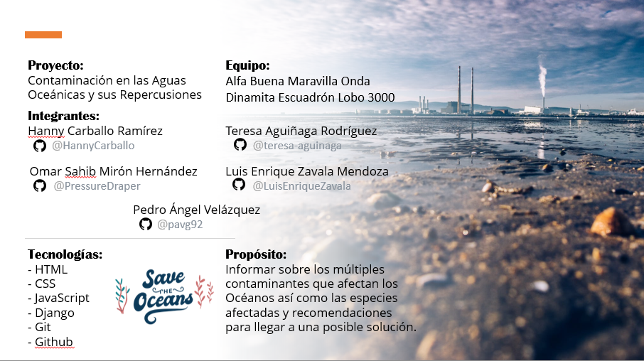
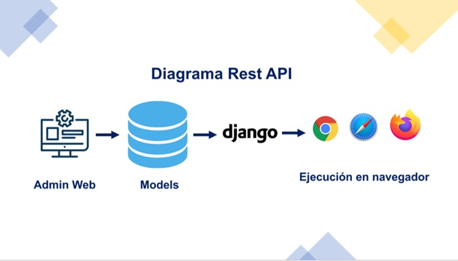
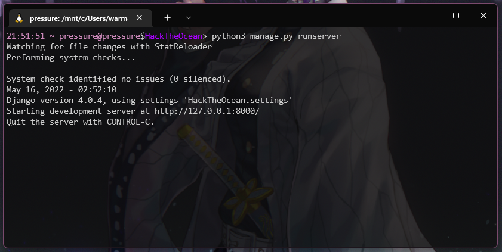

# HackTheOcean

Proyecto realizado para el hackathon "Hack the ocean", organizado por Microsoft.

## Proyecto

Contaminación en las Aguas Oceánicas y sus Repercusiones

## Integrantes

- [Hanny Carballo Ramírez ](https://github.com/HannyCarballo)
- [Teresa Aguiñaga Rodríguez](https://github.com/teresa-aguinaga)
- [Omar Sahib Mirón Hernández](https://github.com/PressureDraper)
- [Luis Enrique Zavala Mendoza](https://github.com/LuisEnriqueZavala)
- [Pedro Ángel Velázquez García](https://github.com/pavg92)

## Propósito

Informar sobre los múltiples contaminantes que afectan los Océanos así como las especies afectadas y recomendaciones para llegar a una posible solución.​

## Tecnologías

- HTML
- CSS
- Javascript
- Django
- Git
- Github

## Diagrama General


## Resultados

A continuación se muestran capturas del funcionamiento de nuestro proyecto


<details open>
<summary> 📕 Uso e Instalación </summary>
 
  
  ## Ejecución Local de Proyecto
  1. Instalar [python 3.8.10](https://www.python.org/ftp/python/3.8.10/python-3.8.10-amd64.exe)
  > Nota: Instalar [PIP](https://phoenixnap.com/kb/install-pip-windows) en caso de que no se haya instalado en el paso anterior.
  2. Instalar Django en la carpeta que contendrá el proyecto, para ello en una terminal ubicada en la carpeta ejecutar:
  ```
  pip install django
  ```
  3. Una vez instalado django clonaremos el repositorio:
  ```
  git clone https://github.com/PressureDraper/HackTheOcean.git
  ```
  4. Ya clonado nuestro repositorio deberemos situarnos en la carpeta raíz del proyecto en donde se encuentra el archivo ```manage.py```, ejecutar el siguiente comando para iniciar el servidor:
  ```
  python3 manage.py runserver
  ```
  Ahora deberíamos poder ejecutarlo exitosamente.
  
  
  
  Por último entraremos en cualquier navegador en la dirección que nos aparece en consola y listo 😊:
   ```
  http://localhost:8000
  ```
</details>
